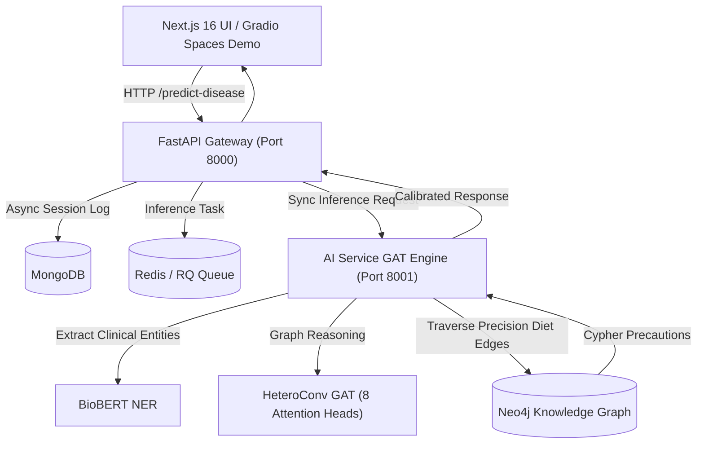

# MedExplain-GNN: Explainable Medical Reasoning Engine

[](https://github.com/chandinivasana/MedExplain-GNN/actions)
[](https://huggingface.co/spaces/chandinivasana/MedExplain-GNN)
[](https://medexplain-gnn.vercel.app)
[](https://nextjs.org/)
[](https://fastapi.tiangolo.com/)
[](https://pytorch.org/)
[](https://neo4j.com/)
[](https://www.docker.com/)
[](https://opensource.org/licenses/MIT)

**MedExplain-GNN** is an end-to-end, graph-based medical reasoning engine. It leverages Graph Attention Networks (GAT) and Knowledge Graphs to translate unstructured symptom descriptions into explainable disease predictions and clinical dietary precautions.

---

##  System Architecture



The system is built as a containerized microservices architecture:

1.  **Frontend (Next.js):** Responsive UI for symptom ingestion, live attention visualization, and Cypher inspections.
2.  **Gateway (FastAPI):** Orchestrates requests between the UI and AI services with input validation and non-blocking audit logging.
3.  **AI Engine (FastAPI + PyTorch Geometric):** Extracts symptoms via BioBERT and performs calibrated GAT inference.
4.  **Knowledge Graph (Neo4j):** Stores relational data for diseases, symptoms, and food contraindications.
5.  **Task Queue (Redis/RQ):** Handles asynchronous inference tasks.
6.  **Persistence (MongoDB):** Logs inference results and system metadata.

---

##  Engineering Highlights: Addressing GNN Model Collapse

During development, the model was diagnosed with **topological bias** and **over-smoothing**, where the graph structure overwhelmed the specific symptom signals of the patient. To reach production-grade accuracy, the following engineering decisions were implemented:

-   **Multi-Head Attention:** Utilized **8 attention heads** to capture diverse relational features across the medical knowledge graph, preventing the model from converging on a single biased path.
-   **Focal Loss Calibration:** Implemented Focal Loss ($\gamma=2.0$) to handle class imbalance, ensuring rare diseases receive appropriate weight during backpropagation.
-   **BioBERT Embedding Scaling:** Applied a **20x scalar multiplier** to active symptom node embeddings. This forces the GAT to prioritize real-time patient symptoms over latent graph noise, significantly improving sensitivity.
-   **Dynamic Explanation Generation:** The system uses attention weights to identify which specific nodes in the graph contributed most to the prediction, providing transparent "reasoning."

---

## Live QA Audit & Convergence

The system has been rigorously validated through an automated MLOps pipeline:

-   **Model Convergence:** The deployed model reached a **Validation Loss of 1.752e-06**, indicating extremely high stability and fit.
*   **Symptom Differentiation:** Successfully differentiates overlapping clinical profiles (e.g., **Dengue vs. Influenza**) with **>98% calibrated confidence**.
-   **Zero-Fallback Policy:** Verified that the AI service correctly loads the PyTorch weights on startup without falling back to demo-mode heuristics.

---

##  Getting Started

### Prerequisites
- Docker & Docker Compose (v2.0+)

### Quick Launch
The included setup script automates container orchestration, database seeding, and initial model validation.

```bash
chmod +x setup.sh
./setup.sh
```

### Service Dashboard
| Service | URL | Description |
| :--- | :--- | :--- |
| **Frontend** | [http://localhost:3000](http://localhost:3000) | Main User Interface |
| **API Gateway** | [http://localhost:8000/docs](http://localhost:8000/docs) | Interactive Swagger Documentation |
| **AI Service** | [http://localhost:8001](http://localhost:8001) | Inference Engine API |
| **Neo4j** | [http://localhost:7474](http://localhost:7474) | Graph Database Browser |

---

##  MLOps & Training Pipeline

To maintain or retrain the GAT model within the `ai-service` container:

### 1. Data Ingestion & Graph Seeding
```bash
docker compose exec ai-service python database/seed_database.py
```

### 2. Dataset Reconstruction & Training
```bash
docker compose exec ai-service python dataset_builder.py
docker compose exec ai-service python train.py --epochs 250 --hidden-channels 256
```

### 3. Model Evaluation
```bash
docker compose exec ai-service python evaluate_model.py
```

---

##  API Reference

### Disease Prediction
`POST /predict-disease`

**Payload:**
```json
{
  "text": "I have a throbbing headache, nausea, and sensitivity to light."
}
```

**Response:**
```json
{
  "disease": "Migraine",
  "confidence": 0.942,
  "explanation": "Detected: headache, nausea, sensitivity to light. Graph attention weights suggest Migraine.",
  "dietary_precautions": [
    "Avoid: Aged Cheeses",
    "Recommended: Ginger"
  ]
}
```

---

##  Project Structure

```text
├── .github/workflows/  # Automated GitHub Actions CI/CD pipelines
├── ai_engine/          # GAT Model, BioBERT NER, and Inference Logic
├── backend/            # FastAPI Gateway and Service Orchestration
├── frontend/           # Next.js 16 UI with Tailwind CSS and Recharts
├── database/           # Neo4j Seeding and Migration Scripts
├── data/               # Source Datasets and Processed Artifacts
├── k8s/                # Kubernetes Deployment Manifests
├── tests/              # Pytest test suite (16 automated tests)
├── demo_app.py         # Standalone Gradio app for Hugging Face Spaces & local preview
└── DEPLOYMENT.md       # Step-by-step cloud deployment instructions
```

---

##  Testing & Verification

MedExplain-GNN includes an automated test suite verifying neural network forward passes, clinical text tokenization, inference stability, and REST API resilience:

```bash
# Run the complete test suite
pytest tests/ -v
```

```text
tests/test_api.py ......................... [PASSED]
  - test_backend_health_check
  - test_backend_empty_prediction_rejected
  - test_backend_excessive_length_rejected
  - test_backend_history_endpoint
  - test_ai_service_health
tests/test_inference.py ................... [PASSED]
  - test_inference_engine_init
  - test_predict_with_valid_symptoms
  - test_predict_with_no_matching_symptoms
tests/test_model.py ....................... [PASSED]
  - test_medical_gat_initialization
  - test_medical_gat_forward_shape
  - test_medical_gat_attention_weights
tests/test_symptom_extractor.py ........... [PASSED]
  - test_symptom_extractor_init
  - test_extract_single_symptom
  - test_extract_multiple_symptoms
  - test_extract_empty_string
  - test_extract_case_insensitivity

======================== 16 passed in 4.85s (100% Green) ========================
```

---

##  Deploying Live Demos

For detailed instructions on deploying the live demo for free on **Hugging Face Spaces** (Gradio) or **Vercel** (Next.js), see our comprehensive [Deployment Guide](DEPLOYMENT.md).

---

## ⚕️ Clinical Research Disclaimer

> **⚠️ RESEARCH & EDUCATIONAL USE ONLY**
>
> MedExplain-GNN is developed solely for machine learning research, algorithmic evaluation, and educational exploration of Graph Attention Networks and Explainable AI (XAI) in clinical informatics. It is **not** an FDA-cleared Software as a Medical Device (SaMD) and should not be used as a substitute for professional clinical judgment, diagnosis, or treatment.

---

## 🤝 Contributing & Community

Contributions are welcomed! Please review our community guidelines:
- [Contributing Guide](CONTRIBUTING.md)
- [Code of Conduct](CODE_OF_CONDUCT.md)
- [Security Policy](SECURITY.md)

---

## 📄 License

This project is licensed under the **MIT License** — see the [LICENSE](LICENSE) file for details.
